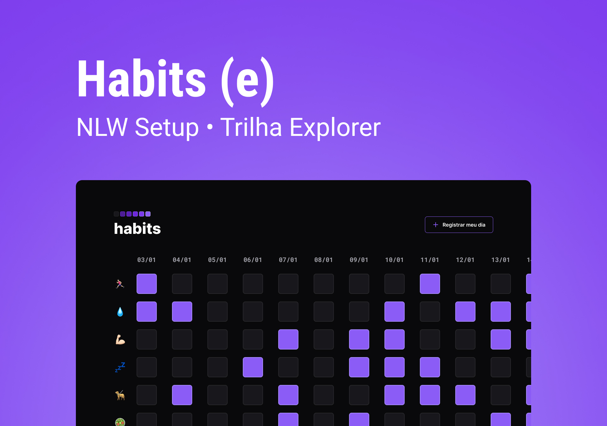

<h1 aligne="center"> Habits </h1>

NLW é um programa exclusivo e gratuito, promovido pela Rocketseat para o ensino de tecnologias WEB.  

  

🚀 Tecnologias:

Esse projeto foi desenvolvido com as seguintes
tecnologias:

- HTML e CSS
- JavaScript
- Git e Github
- Figma

💻 Projeto:

O Habist é um app para ajudar a rastrear os hábitos.

📑 Layout

Você pode visualizar o layout do projeto através desse link {https://www.figma.com/file/kT2qzFMfV9cHgRDnXcYqfS/Habits-(e)-(Community)?node-id=75%3A128&t=ncd7Q66WcnXkSY01-1}. É necessário ter conta no Figma para acessá-lo, link:{http://figma.com}.
